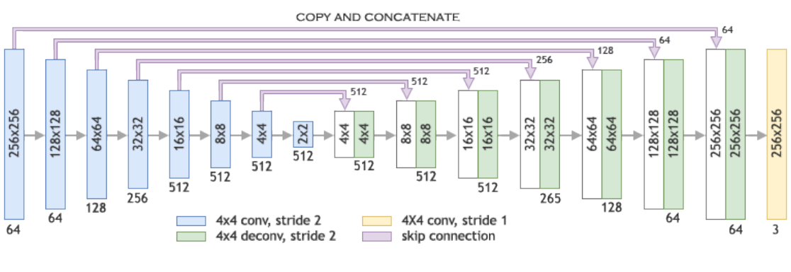
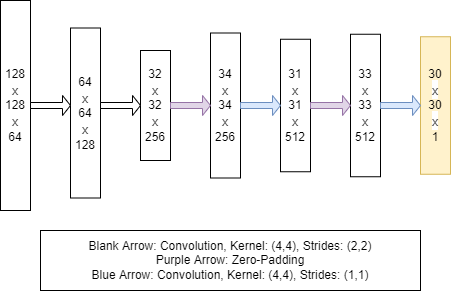

# Pix2Pix
A Pix2Pix cGAN to Convert Labels to the Original Image of the Corresponding Façade

Dataset: <a href='http://efrosgans.eecs.berkeley.edu/pix2pix/datasets/'>Dataset</a>

<h2>Generator Architecture (U-net): </h2>

<h2>Discriminator Architecture (Patch-GAN): </h2>

